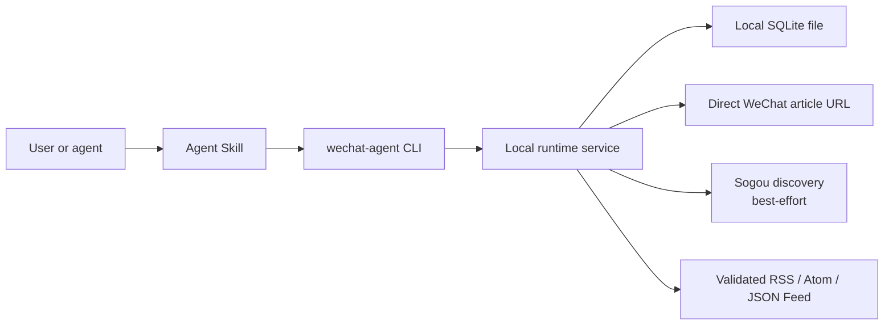

# Architecture

## Current product boundary

wechat-agent-kit is a local, CLI-only application. The npx package installs
Agent Skills and exposes `wechat-agent`; those Skills invoke the JSON CLI. The
current release has no MCP transport, HTTP server, daemon, or built-in
scheduler.

The CLI is the stable automation boundary: commands return JSON and failures
remain visible. Skills describe when and how to call it; they do not contain a
second implementation.

## Data sources and guarantees

| Capability | Source | Guarantee |
| --- | --- | --- |
| Local article search | SQLite index | Available while the local database is readable |
| Global discovery | Sogou WeChat Search | Best-effort; markup, rate limits, and captcha can interrupt it |
| Article reading | Direct `mp.weixin.qq.com` URL | Best-effort; deleted, blocked, or changed pages remain unavailable |
| Persistent subscription | User-provided RSS, Atom, or JSON Feed URL | Feed is validated before storage; availability belongs to its host |
| Refresh | Explicit `wechat-agent sync` | Runs only when invoked; no automatic monitoring |

The project does not infer a feed from a public-account name and does not claim
that Sogou search is a durable subscription source.

## Runtime flow

1. `query --keywords` resolves a keyword-search intent; `query --account` resolves
   an account-window intent with optional inclusive publication dates. `local`
   queries SQLite, `global` queries Sogou, and `hybrid` runs both concurrently.
   Fast query output separates confirmed original URLs from discovery redirects.
2. `read` accepts an indexed article ID or a direct WeChat/Sogou result URL,
   validates redirects, parses the page, and stores provenance locally.
3. `subscribe` fetches a supplied URL, confirms RSS/Atom/JSON Feed format, and
   then stores the subscription.
4. `sync` fetches one or all active feeds, upserts articles idempotently,
   advances cursors, and records source health and a sync run.
5. `status` reports the database path, subscriptions, source health, and recent
   runs. It explicitly reports that scheduling is disabled.

## Storage

The runtime automatically opens one local file, `wechat-agent.sqlite`, using
Node's built-in `node:sqlite`; no database server or native npm SQLite package
is required. Migrations create account, article, provenance, subscription,
sync, and health tables. FTS5 trigram search is optional: initialization records
whether it is available and falls back to compatible local search behavior.

The default platform paths and deletion behavior are documented in
[PRIVACY.md](../PRIVACY.md). `WECHAT_AGENT_DATA_DIR` supports isolated testing
or an intentional custom location.

## Security model

All fetched HTML and feed content is untrusted data. The HTTP layer requires
HTTPS, rejects embedded credentials, blocks local/private network targets,
revalidates redirects, sets timeouts, and enforces response-size limits. A
connector error is surfaced rather than converted into a successful empty
result.

Installation is explicit and supports `--dry-run`. It backs up replaced Skills,
writes an ownership manifest, and only removes unmodified managed files during
uninstall. npm `postinstall` is not used.

Legacy Python login behavior is isolated from the Node architecture. Its WC01
credential representation is not encrypted; see
[legacy-python.md](legacy-python.md).

See [workflow-and-data-processing.md](workflow-and-data-processing.md) for the
full flowcharts and data rules, and [testing.md](testing.md) for release gates.
